# Git & Github

## I. Giới thiệu chung
- Download Git: [link](https://git-scm.com/downloads)
- docs: ``/Git/git-github-reference.pdf``
- Flow cơ bản khi sử dụng Git
    - Clone project từ server về Local Repository
    - Check-out 1 nhánh từ Local Repository về Working Space
    - thêm, sửa, xoá file tại Working Space
    - Add : xác nhận sự thay đổi của các files (đưa đến vùng Staging Area)
    - Commit: cập nhật sự thay đổi lên Local Repository
    - merge: gộp các Branch lại

## II. Git
### 1. Lệnh trong Git
#### 1. Thiết lập chứng thực cá nhân
``` bash
git config --global user.name "User Name"
```
``` bash
git config --global user.email "username@gmail.com"
``` 
#### 2. Tạo một kho chứa Git
``` bash
git init
``` 
#### 3. Sao chép một kho chứa đã tồn tại
``` bash
git clone <repository_url>
```
#### 4. Nhánh trong Git
##### 1. Kiểm tra nhánh 
``` bash
git branch
```
##### 2. Tạo mới một nhánh(branch)
``` bash
git branch <name_branch>
```
##### 3. Tạo và chuyển vào một nhánh(branch) mới
``` bash
git checkout -b <name_branch>
```
##### 4. Chuyển vào nhánh đã chọn
``` bash
git checkout <name_branch>
```
##### 5. Xoá bỏ nhánh
- Xoá nhánh cục bộ
``` bash
git branch -d <name_branch>
```
- Xoá nhánh từ xa
``` bash
git push origin --delete <name_branch>
```

#### 5. Cập nhật những file đã thay đổi
##### 1. thêm các thay đổi vào staging area
``` bash
git add file
```
##### 2. Commit thông tin thay đổi
``` bash
git commit -m "Message"
```
##### 3. xem lại lịch sử commit
``` bash
git log --graph --all
```
##### 4. Reset
- Git reset được sử dụng để di chuyển HEAD (con trỏ chỉ đến commit hiện tại) trỏ đến một commit cụ thể hoặc xoá những thêm thay đổi vào staging area
``` bash
git reset <commit_hash>
```


#### 6. thao tác giữa local_repo với server
##### 1. thêm một remote_url trước khi push lên response
``` bash
git remote add origin <remote_url>
```
##### 2. Kiểm tra remote_url
``` bash
git remote 
```
##### 2. Xem thay đổi trước khi push
``` bash
git diff
```
##### 3. Cập nhật thay đổi lên Local Repository trên server
``` bash
git push origin <name_branch>
```
##### 4. Pull từ remote repository
``` bash
git pull origin master
```
#### 7. Lệnh gộp nhánh 
##### 1. Gộp Merge
``` bash
git merge <new_branch>
```
##### 2. Gộp các commit
``` bash
git rebase -i <name_branch>
```
#### 8. Tag trong Git
##### 1. Khái niệm
- Tag là chức năng đặt tên một cách đơn giản của Git, nó cho phép ta xác định một cách rõ ràng các phiên bản mã nguồn (code) của dự án
- Có 2 loại tag là annotated và lightweight.
    - ``Lightweight tag`` thực chất chỉ là đánh dấu (bookmark) cho một commit, vì chúng chỉ lưu trữ hàm băm (hash) của commit mà chúng tham chiếu
    - ``Annotated tag`` thì mạnh hơn. Ngoài tên nó còn có thể lưu trữ dữ liệu bổ sung như Tên tác giả (-s), tin nhắn (-m: message), và ngày dưới dạng các đối tượng đầy đủ trong cơ sở dữ liệu Git
##### 2. Tạo lightweight tag
``` bash
git tag <tag_identifier>
```
##### 3. Tạo Annotated tag
``` bash
git tag -a <tag_identifier> -s "tagger" -m "Messanger"
```
##### 4. Liệt kê danh sách tag
``` bash
git tag -l -n3
```
##### 5. Thông tin chi tiết tag
``` bash
git show <tag_identifier>
```
##### 6. thay đổi thông tin tag
``` bash
git tag -a -f <tag_identifier> <commit_hash>
```
##### 7. xoá tag
``` bash
git tag -d <tag_identifier>
```
##### 8. Quản lý tag trên remote repository
- đẩy toàn bộ tag lên repo 
``` bash
git push --tags
```
- Đẩy riêng tag lên repo
``` bash
git push origin <tag_identifier>
```
### 2. Gộp các nhánh trong Git
#### 1. bài toán
- Tạo mới folder ``git-origin``, folder này để làm mẫu cho các ví dụ bên dưới
- Khởi tạo git bằng câu lệnh ``git init``
- Tại nhánh master ta tạo các commit là ``A1`` và ``A2``
- Tại commit A2 ta bắt đầu tạo nhánh branchB: ``git checkout -b branchB``
- Tại nhánh branchB ta tạo commit ``B1``
- Quay lại nhánh master ta tạo commit ``A3`` và ``A4``
- Quay lại nhánh branchB ta tạo commit ``B2``
- Như vậy nếu tính theo dòng thời gian ta có lịch sử commit là: ``A1 => A2 => B1 => A3 => A4 => B2``
- Tổng kết:
    - Có 2 nhánh là ``master`` và ``branchB``
    - Nhiệm vụ là merge nhánh ``branchB`` vào nhánh ``master``
    - Nhánh master màu xanh: ``A1 => A2 => A3 => A4``
    - Nhánh branchB màu đỏ: ``B1 => B2``
    - Hiện tại con trỏ HEAD đang đứng tại nhánh ``master`` commit ``A4``
- Git Graph: 

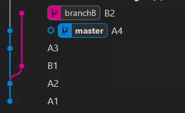

#### 2. Git merge
- Chuyển sang nhánh master: ``git checkout master``
- Lúc này đang đứng tại commit ``A4``
- Merge nhánh ``branchB`` vào ``master``: ``git merge branchB``
- Nếu không có conflict thì việc tự động merge thành công
- Tại nhánh ``master`` xuất hiện thêm commit có nội dung: ``Merge branch 'branchB'``
- Sau khi merge: ``A1 => A2 => B1 => A3 => A4 => B2 => commit merged``

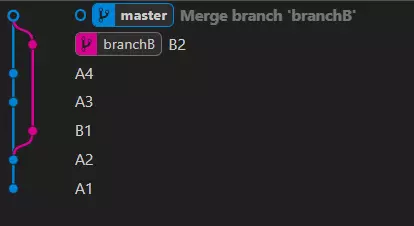

#### 3. Git rebase v1
- Chuyển sang nhánh branchB: ``git checkout branchB``
- Lúc này đang đứng tại commit ``B2``
- Rebase nhánh ``master`` vào ``branchB``: ``git rebase master``
- Chuyển sang nhánh ``master``: ``git checkout master``
- Merge nhánh ``branchB`` vào ``master``: ``git merge branchB``
- Lúc này tất cả commit của ``branchB`` sẽ được nối tiếp vào sau commit cuối ``A4`` của nhánh ``master``
- Sau khi rebase: ``A1 => A2 => A3 => A4 => B1 => B2``

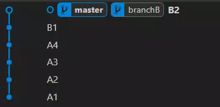
#### 4. Git rebase v2
- Chuyển sang nhánh master: ``git checkout master``
- Lúc này đang đứng tại commit ``A4``
- Rebase nhánh ``branchB`` vào ``master``: ``git rebase branchB``
- Lúc này tất cả ``commit`` của ``branchB`` sẽ được nối tiếp vào ``master`` tại commit bắt đầu rẽ nhánh là ``A2``
- Sau khi rebase: ``A1 => A2 => B1 => B2 => A3 => A4``

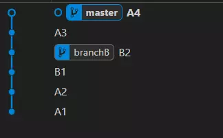

### 3. Giải Quyết Xung Đột (Conflict Resolution) sau khi thực hiện gộp các nhánh (merge)
- Xung đột xảy ra khi có thay đổi mâu thuẫn giữa các chi nhánh. Khi gặp xung đột, Git sẽ thông báo và bạn cần mở file bị xung đột để chỉnh sửa.
- Xác định phần mã bị xung đột nằm giữa các phần ``<<<<<<< HEAD và >>>>>>>``. Chỉnh sửa các phần mã đó.
- Sau khi chỉnh sửa, thêm lại thay đổi và commit với lệnh git add . và git commit -m "Giải quyết xung đột".

## III. Github
### 1. Release trên GitHub
#### 1. Khái niệm
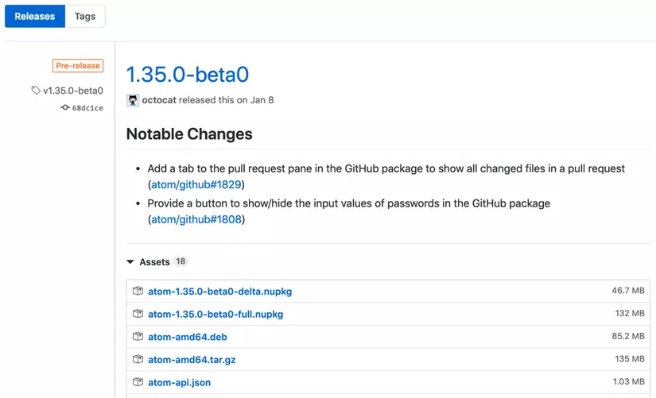
- release được gọi là phiên bản phát hành
- Mục đích tạo release là để chia sẻ đóng gói ứng dụng, cùng các ghi chú phát hành và các link tới các file tài liệu ứng dụng cho mọi người trong team, công ty có sửa dụng.

#### 2. Tạo release trên GitHub
##### B1: Di chuyển đến trang chủ (main page) của repository trên GitHub mà ta cần tạo release.
##### B2: Chọn release* - nút link ngay dưới tên repositry.
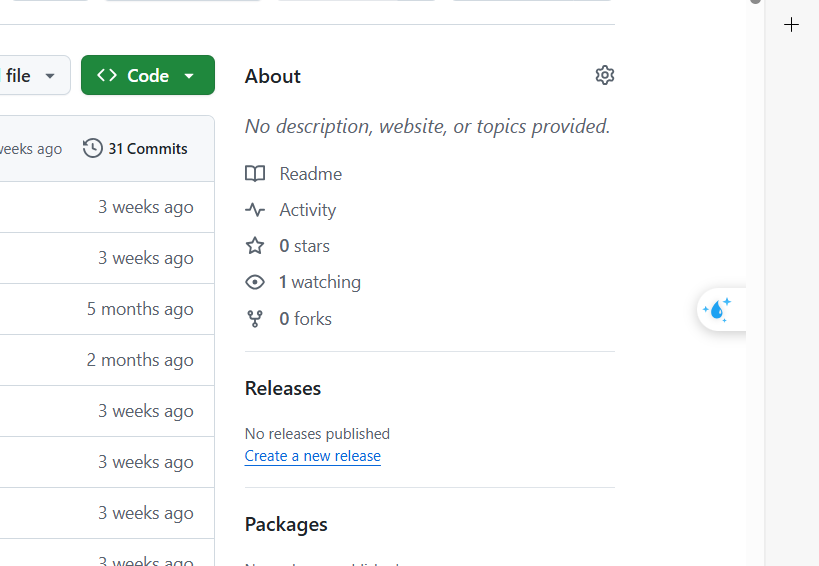
##### B3: Click chọn Draft a new release.
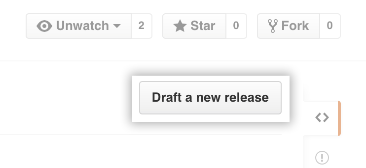

##### B4: Nhập phiên bản cho release của ta. Phiên bản dựa trên Git tag.
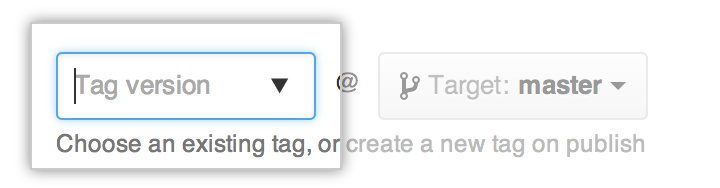
##### B5: Ngay ô bên phải chọn branch của dự án cần release (drop-down-list)
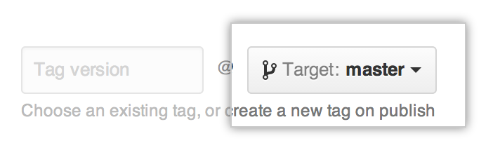
##### B6: Nhập tiêu đề và nội dung cho release này.
##### B7: Kéo thả các file tài liệu liên quan cho release phiên bản này lên binaries box.
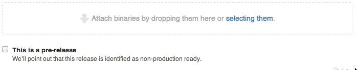
##### B8: Nếu release là không ổn định, chưa chính thức thì ta cần thông báo cho mọi người (liên quan) biết bằng cách chọn This is a pre-release.
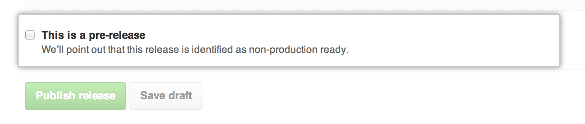
##### B9: Nếu bạn sẵn sàng công khai bản release này thì click chọn Publish release , bằng không thì chọn Save draft.
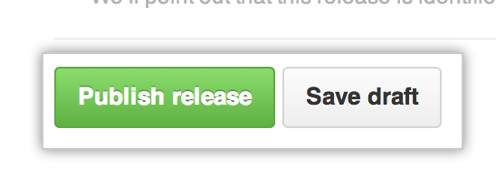


