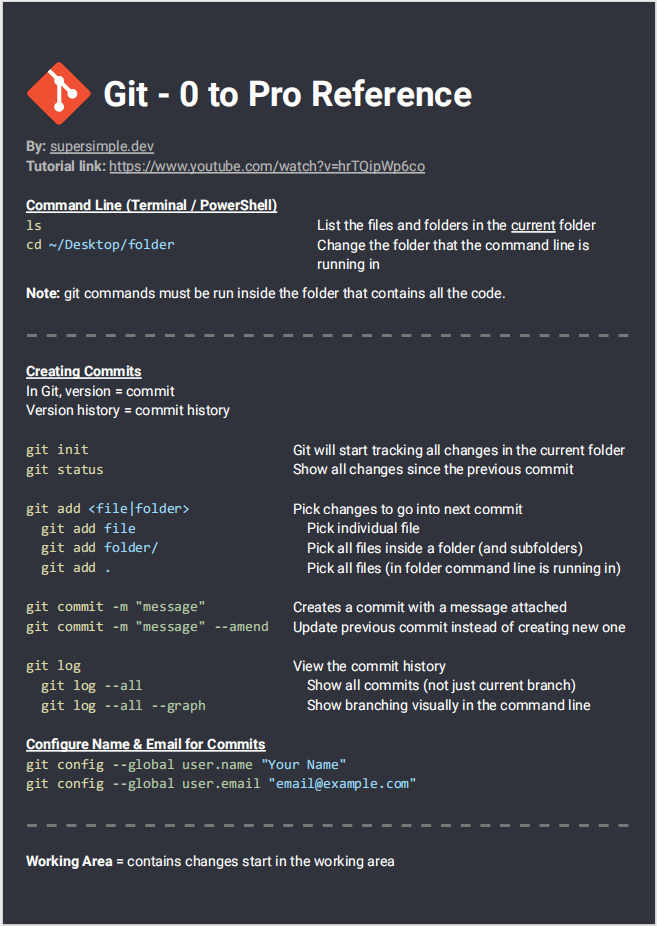

# Cách viết README file
## I. Giới thiệu chung
### 1. Markdown dùng làm gì ?
- Thường được dùng để viết tài liệu kỹ thuật
### 2. Extension trên Vscode
- Markdown All in One
- Markdown Preview Enhance
- Xóa keyboard shortcuts đùng để gõ tiếng việt
## II. Các phương pháp thường dùng trong Markdown
### 1. Formating
- bằng cách dùng dấu # để tạo thành các heading (giống với heading trong word). Tạo được tối đa 6 heading:\
Heading 1:  #heading \
Heading 2:  ##heading \
Heading 3: ###heading \
Không dùng # thì là đoạn văn
### 2. Fonts
- Bôi đậm dùng 2 dấu *trước và sau: **đậm**
- In nghiêng dùng 1 dấu */_ trước và sau : *nghiêng* hoặc _nghiêng_
- Cả đậm cả nghiêng: ***all***
- Ghạch bỏ : ~~delete~~
- Để giữi lại cá ký tự đặc biệt như * _ thì dùng :  \*\*ví dụ\*\*
### 3. Quotation 
> ví dụ về quotation
### 4. Dùng dấu ` nhấn mạnh chữ trong câu: 
"ví dụ"
### 5. Tạo bảng:
- Căn lề cho phần tử trong ô dùng :

| STT | Cột 1 | Cột 2 |
| :-: | :---: | :---: |
| 1 | Dòng 11 | Dòng 21 |
| 2 | Dòng 12 | Dòng 22 |
| 3 | Dòng 13 | Dòng 23 |
| 4 | Dòng 14 | Dòng 24 |

- Format table
Code Block: 
```c
    printf("code block"); 
``` 
Hoặc dùng tab

    codeb lock

### 6. Ghách ngang : Dùng 3 - - - hoặc dung ***
---
***
### 7. Chèn link
- dùng ngoặc tròn:
[youtube.com](https://www.youtube.com/)
### 8. Hình ảnh
Để  chèn ảnh trong vscode cần để ảnh trong folder với file readme 
Cấu trúc : 
### 9. Phép toán 
$\alpha$
$\varphi$
Số ở trên dưới:
$x^2$
$x^(n+1)$
$x_1$
$H_2SO_4$
Mũi tên: $\to$
Vô cùng: $\infty$
Phân số: $\frac{1}{2}$
